# 💻 Enterprise HelpDesk (Jira Service Management Project)

## 📌 Project Overview
This repository contains the design, implementation, and configuration documentation of an enterprise-level **IT Service Management (ITSM)** system built inside **Jira Service Management (JSM)**. This project replicates live L1/L2 IT Support and Desktop Support operations, focusing on service catalog deployment, incident tracking, and workflow automation.

---

## 🏗️ Project Architecture & Implementation

### 1. Customer-Facing Service Portal (Front-End)
* **Categorized Help Center**: Deployed an online customer portal structured with dedicated IT service request categories (Computers, Applications, Login Accounts).
* **Data-Driven Intake Forms**: Configured standardized request types for high-frequency IT issues:
  * **Laptop & Hardware Support**: Custom form layout to enforce corporate asset tracking.
  * **Software & Application Access**: Integrated baseline justification parameters.
  * **Account & Password Lockout**: Configured high-visibility intake fields for quick identification.

*📸 **Project Setup & Base Template Configuration:***
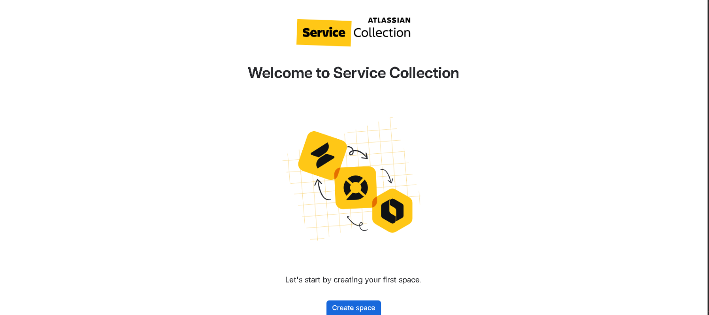

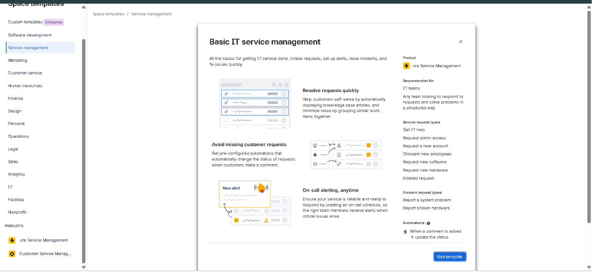

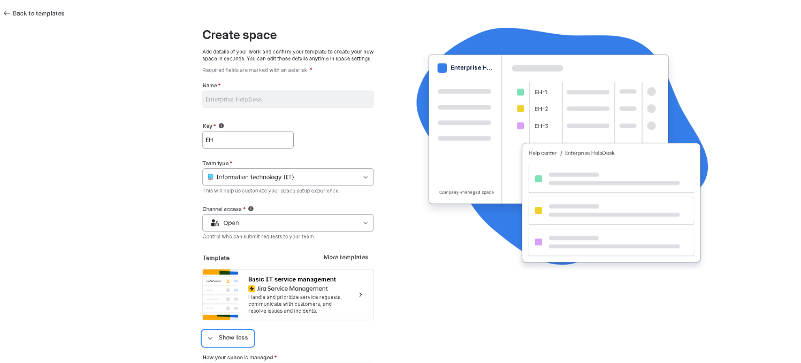

*📸 **Customized Support Catalogs & Requests(Portal for user reqest):***
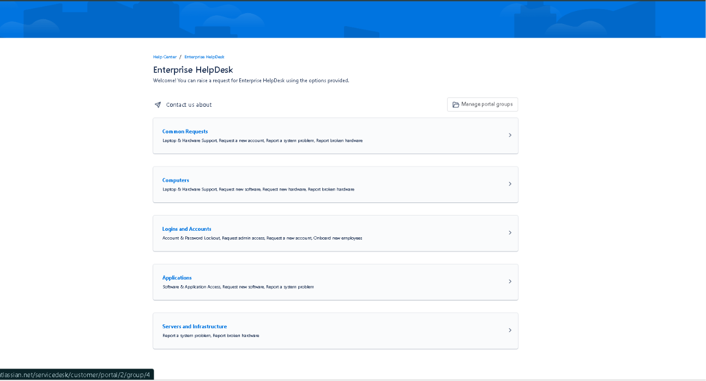

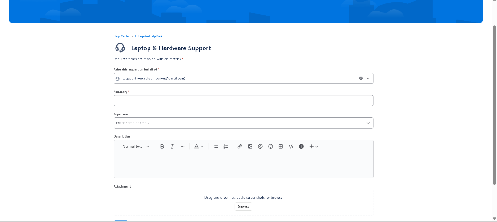

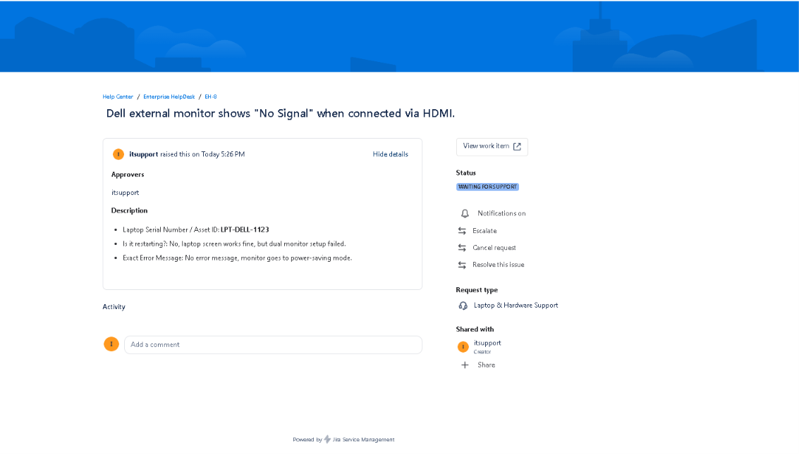

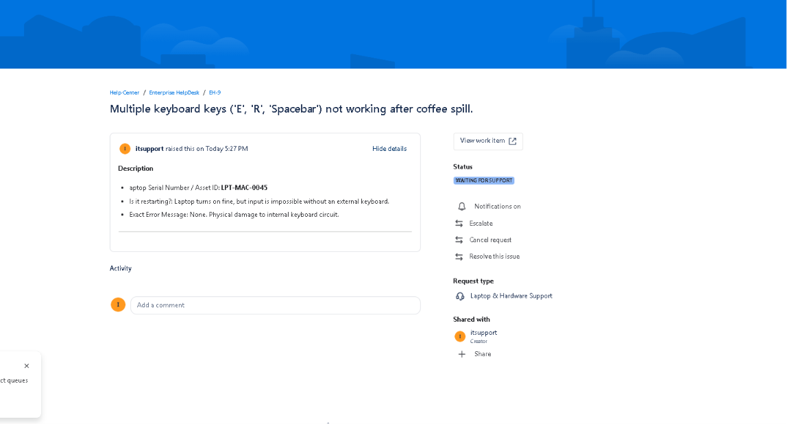

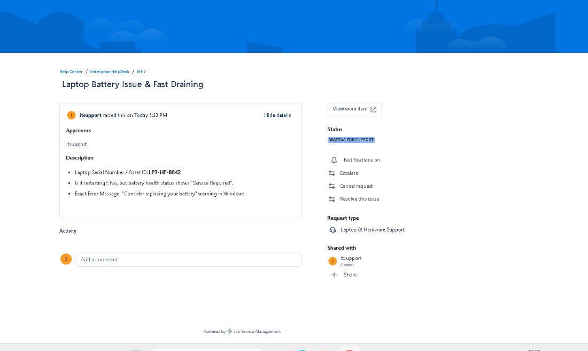

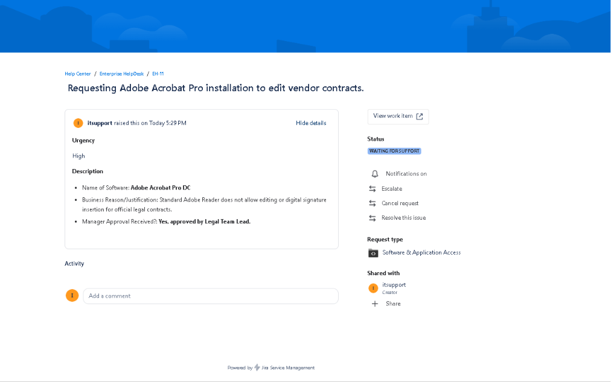

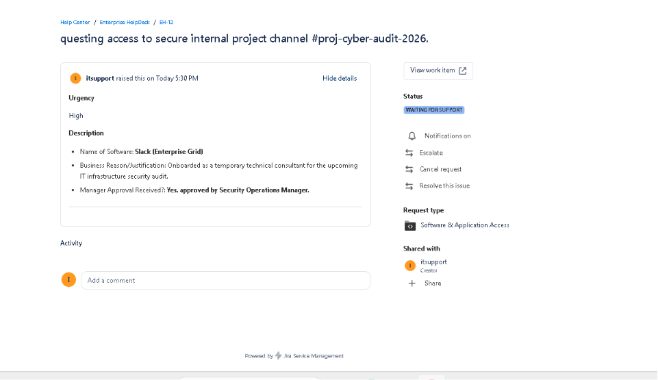

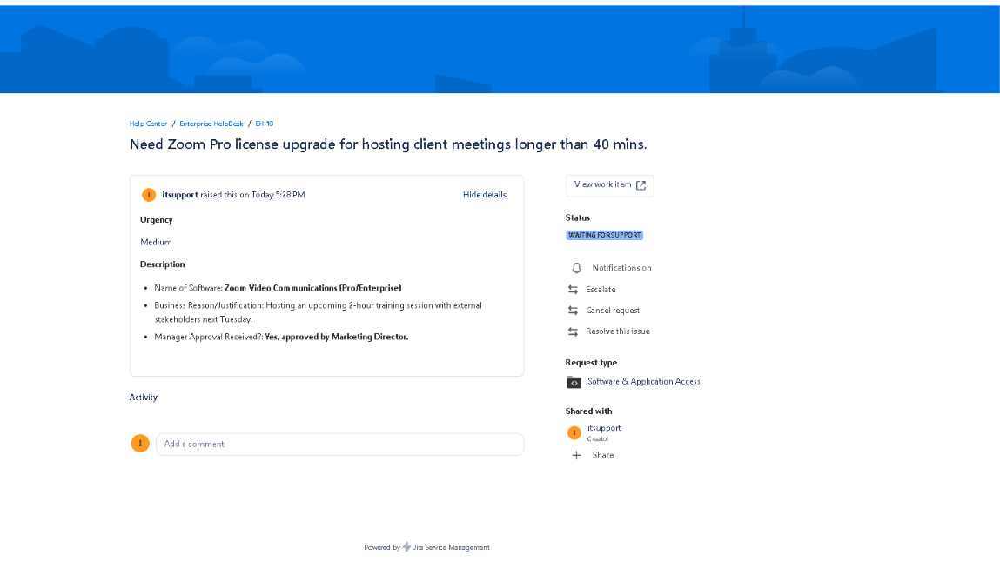

---

### 2. Incident Management & Queue Configuration (Back-End)
* **Ticket Lifecycle Tracking**: Structured a 4-stage operational workflow (`Waiting for Support` ➔ `In Progress` ➔ `Pending Customer` ➔ `Done`) to track issues from ingestion to closure.
* **Optimized Agent Queues**: Built isolated queues to separate regular service requests from high-priority incident tickets, reducing manual dispatch overhead.
* **Production Simulation**: Logged and processed simulated tickets (e.g., *Laptop Screen Flickering* & *VPN Access Requests*) to validate end-to-end diagnostic resolution paths.

*📸 **Live Ticket Simulation & Queue Tracking:***

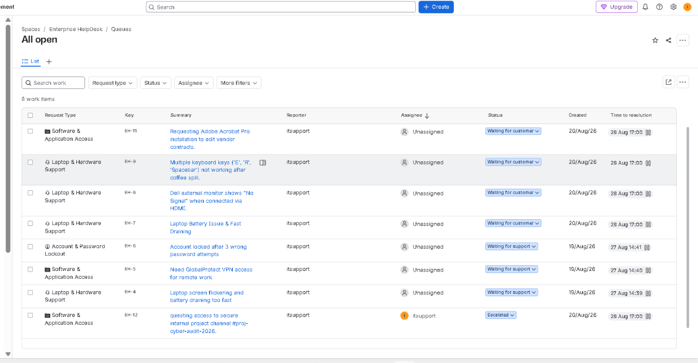
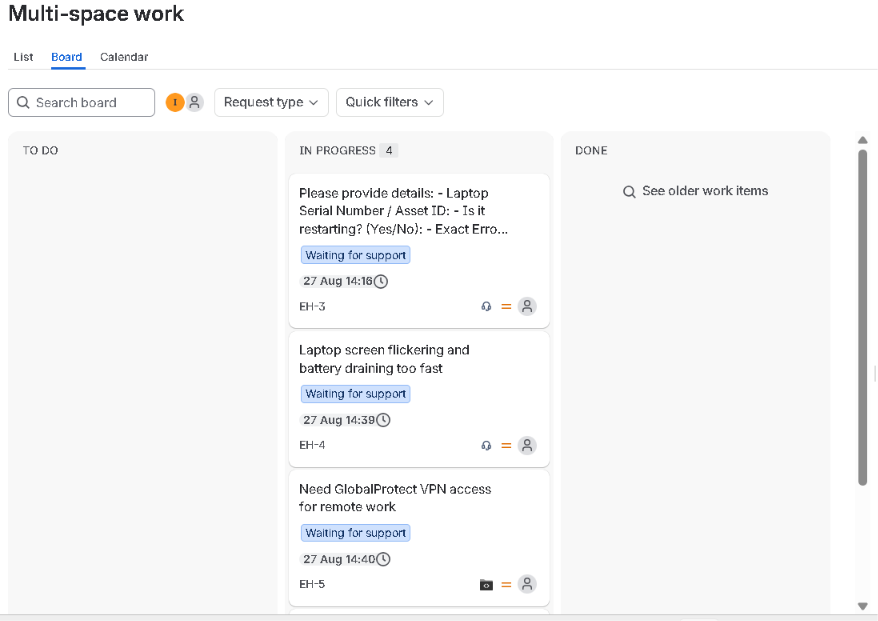
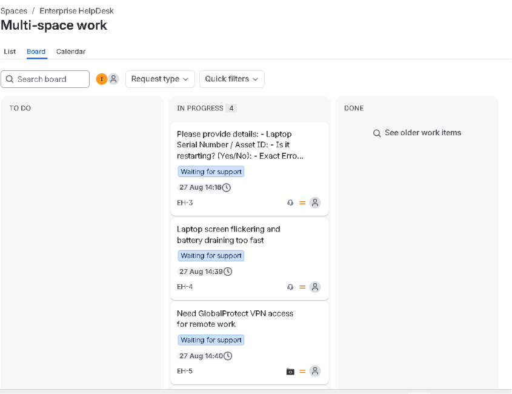
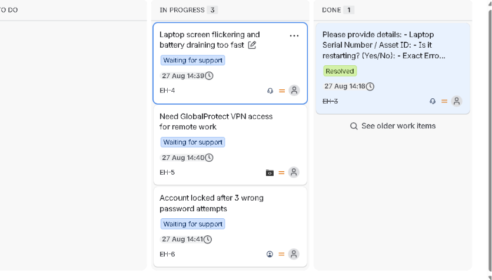

---

### 3. Advanced Jira Work Management Automations (Production-Grade Rules)

Here is the functional logic and visual proof of the custom automation workflows built into the system to minimize manual IT dispatch overhead:

* **Account Lockout Auto-Assignment**: Set up an immediate route to auto-assign all incoming 'Password' or 'Lockout' tickets to the active technician.
* **VIP / Manager Escalation**: Upgrades a ticket to `Highest Priority` if keywords like *Manager*, *Urgent*, or *CEO* are detected.
* **Hardware Team Dispatcher**: Configured automated email notifications to inventory personnel (`tech@store.com`) whenever asset replacements are triggered.
* **Automatic Customer Response**: Deployed an instant system-generated comment on new tickets to communicate initial expectations.
* **Hardware Asset ID Mandate**: Moves a ticket to `Waiting for Customer` status if the *Asset ID* field is left empty during submittal.
* **Automated CSAT Survey Dispatch**: Automatically emails a satisfaction survey to the user the exact second a ticket is marked `Done`.
* **Dynamic Ticket Reopening**: Moves a closed ticket back to `In Progress` if a customer posts a follow-up comment.
* **Urgent Alert for Aging Tickets**: Daily morning sweep that places an escalation flag on any item stuck in `In Progress` for more than 5 days.

*📸 **Core Automations Architecture Map:***

### 🖥️ 1. Auto-Assign Software Tickets to App Team
* **Description**: Automatically scans incoming service requests for application and software deployment issues. If matched, it circumvents the general L1 queue and routes the ticket directly to the specialized Application Support Team to reduce response lag.
* **Visual Configuration**:

---

### 🔑 2. Auto-Assign Urgent Password Tickets
* **Description**: Triggers instantly upon new ticket ingestion if credential or account block keys are detected. It bypasses manual triage and auto-assigns the ticket to an active technician for immediate access remediation.
* **Visual Configuration**:

---

### 🚨 3. VIP Manager Escalation Rule
* **Description**: Monitors inbound ticket metadata for executive markers or keywords like *Manager*, *Urgent*, or *CEO*. Upon detection, it programmatically escalates the issue field status to **Highest Priority** and flags the incident response track.
* **Visual Configuration**:

---

### 📦 4. Hardware Alert Email Notification
* **Description**: Handles cross-functional logistics synchronization. When an end-user logs a physical device failure or device swap request, this rule sends an external email dispatch to the inventory warehouse supervisor to pre-stage physical asset stock.
* **Visual Configuration**:

---

### 🛑 5. Hardware Asset ID Mandate
* **Description**: Acts as an inline form data validator. If a consumer submits a hardware breakdown ticket but leaves the critical **Asset ID / Serial Number** layout blank, the machine catches it, updates the status to `Waiting for Customer`, and flags it with an instruction note.
* **Visual Configuration**:

---

### 🤝 6. First Response SLA Greeting
* **Description**: Ensures instant engagement metrics. The exact second an end-user logs a complaint on the service portal, the engine prints an automatic professional welcome and tracking comment on the ticket history stream to maximize Customer Satisfaction (CSAT).
* **Visual Configuration**:

---

### 📊 7. CSAT Feedback Survey
* **Description**: Governs the final stage of the ticket lifecycle. When a field engineer completes the fix and transitions the state architecture to **Done**, this workflow automatically emails a structured star-rating and satisfaction evaluation poll to the client.
* **Visual Configuration**:

---

### 🔄 8. Reopen Ticket on Customer Reply
* **Description**: Safeguards resolved data loops. If an end-user responds or replies to a closed or archived request ticket, the automation identifies the user comment and dynamically shifts the workspace state layout back into the active **In Progress** view.
* **Visual Configuration**:

---

### 🧹 9. Auto-Close Inactive Tickets
* **Description**: Manages dashboard hygiene via a nightly database cron sweep. It automatically identifies stagnant tickets residing under the `Waiting for Customer` column and transitions them to full closure if the client fails to reply within **3 business days**.
* **Visual Configuration**:

---

### 🔐 10. Account & Password Lockout (Portal Form Reference)
* **Description**: Captures and displays the front-end intake schema for high-priority user validation requests, serving as the user entry point that drives the background assignment matrix.
* **Visual Configuration**:

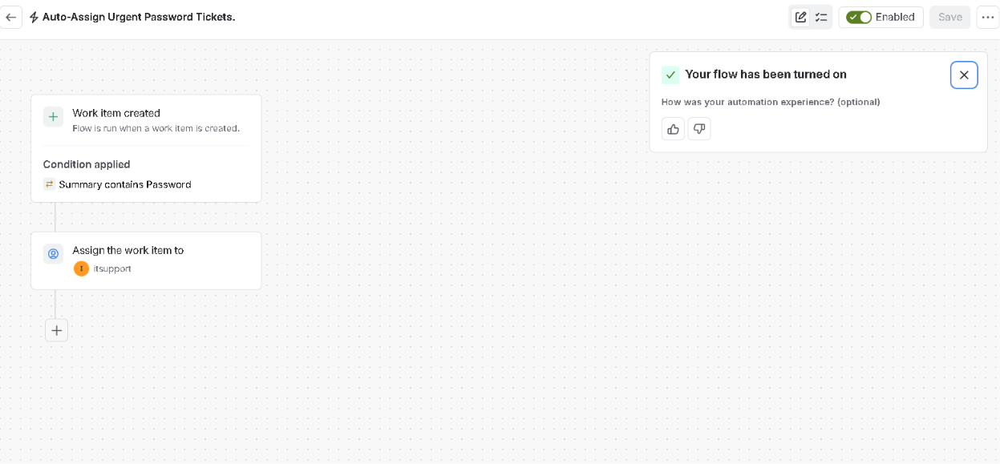

---

## 💡 Technical Core Competencies Demonstrated
* **ITSM Framework**: Hands-on management of incidents vs. service requests under standard operational guidelines.
* **Jira Administration**: Practical proficiency in request schemas, custom field validation, status transitions, and administrative diagnostics.
* **Automation Engineering**: Deep utilization of complex conditional logic (When ➔ If ➔ Then) to optimize IT department overhead.
